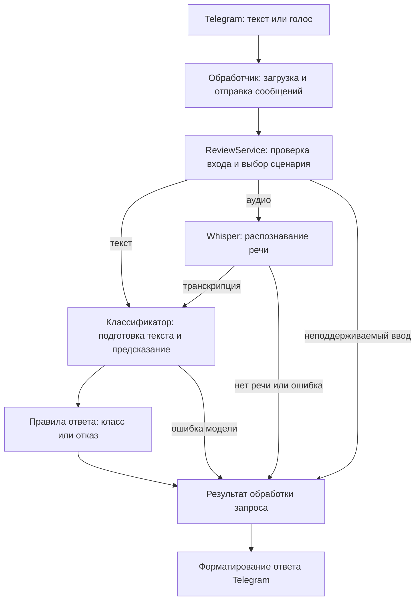

# Обратная связь по плану проекта

Дата ревью: 13 сентября 2026 года.

Статус: историческое ревью до переработки плана 14 сентября 2026 года.
Замечания и номера разделов ниже относятся к
[прежней редакции](https://github.com/ksdergach/ru-review-sentiment-bot/blob/5d2119ee7c0681f6c34e848c84e9f522e005dbf0/docs/team_plan.md).
[Действующий план](team_plan.md) сверён с исходным заданием преподавателя:
голосовые сообщения Telegram, три класса тональности и загруженный кинодатасет.
Ограничение на товары, обязательный `noise` и изображения исключены;
TTS описан как дополнительный эксперимент. Этот документ сохранён для истории,
а не как список открытых замечаний или требований к новой редакции.

Ревью включает четыре замечания к подготовке данных и методике оценки, а также
архитектурный разбор в разделе 5. P1 означает высокий
приоритет: проблема влияет на обоснованность исследовательского вывода. P2 означает
средний приоритет: правило нужно уточнить до реализации соответствующего этапа.
Замечания 1, 2 и 4 относятся к дополнительной пятой неделе, замечание 3 — к MVP при
использовании WB Review Dataset.

## 1. [P1] Сравнение M0 и M2 не позволяет выделить вклад изображения

**Где:** раздел 15 «Архитектура мультимодальной модели» и день 1 раздела 17.

Для M2 предусмотрено обучение на парных данных, а для M0 в календаре указана только
оценка существующей текстовой модели. Обучение сопоставимой текстовой модели на том
же парном train-наборе явно не предусмотрено.

Из-за этого улучшение M2 может объясняться дополнительным обучением на данных нового
домена. Одинаковый test-набор сам по себе не позволяет приписать улучшение добавлению
изображений.

**Что изменить:** обучить для M0 отдельную текстовую классификационную голову на том
же парном train-наборе, используя тот же текстовый энкодер и сопоставимый бюджет
подбора параметров. Для M0 и M2 зафиксировать одинаковый режим заморозки текстового
энкодера и общий validation-набор. Исходную модель MVP сохранить как дополнительную
точку сравнения.

## 2. [P1] В мультимодальном эксперименте меняется смысл класса `noise`

**Где:** раздел 14 «Данные для мультимодальности», список примеров класса `noise`.

В MVP класс `noise` означает, что сообщение не является отзывом. В мультимодальной
части к нему предлагается относить и настоящий отзыв с нерелевантным изображением.
Например, текст «Наушники отличные» получает метку `positive` с фотографией наушников,
но `noise` с посторонней фотографией.

Для текстовой модели M0 эти входы одинаковы, хотя целевые метки различаются. Поэтому
сравнение M0 и M2 будет частично измерять способность проверять соответствие фотографии
отзыву, а не влияние изображения на распознавание тональности. Кроме того, поведение
мультимодальной модели и текстового резервного режима станет несогласованным.

**Что изменить:** сохранить метку тональности настоящего отзыва независимо от
релевантности фотографии. Соответствие изображения обрабатывать отдельно либо
исключить несогласованные пары из основного эксперимента по тональности. Единое
определение `noise` закрепить в правилах разметки.

## 3. [P2] Для WB Review Dataset не определена сборка входного текста

**Где:** раздел 3.2 «Дополнительный источник» и раздел 4 «Подготовка и разбиение данных».

План начинает очистку с удаления пустых записей, но не определяет, какие поля WB
составляют текст отзыва. В датасете есть отдельные поля `text`, `pros` и `cons`;
в опубликованном предпросмотре встречаются полноценные отзывы с пустым `text`
и заполненными другими полями. Это видно в [схеме и предпросмотре WB Review Dataset](https://huggingface.co/datasets/Hplss/wb-review-dataset).

Если загрузчик использует только `text`, он потеряет часть отзывов и может отбросить
достоинства или недостатки, определяющие тональность. Тогда внешняя оценка будет
зависеть от неполного представления исходного отзыва.

**Что изменить:** до удаления пустых записей собрать единый текст из непустых
`text`, `pros` и `cons`. Зафиксировать порядок полей, разделители и обработку пропусков.
Фильтрацию пустых отзывов и дедупликацию выполнять по полученному представлению;
исходные поля сохранить для аудита.

## 4. [P2] В календаре пятой недели test используется слишком рано

**Где:** раздел 17, день 1 «Проверка данных и baseline».

На первый день назначена оценка M0 на парном test-наборе, после которой ещё предстоит
утвердить размер эксперимента и критерий остановки, разработать M2 и подобрать его
параметры. Такой порядок создаёт риск, что результаты test повлияют на решения
об эксперименте, несмотря на общее правило не использовать test для настройки.

**Что изменить:** в дни 1–3 оценивать промежуточные варианты на validation. Размер
эксперимента, критерии остановки и конфигурации всех сравниваемых моделей зафиксировать
до просмотра test-метрик. На четвёртый день провести итоговую оценку M0, M1 и M2 на
одном парном test-наборе. Варианты абляции также определить до этой оценки.

## 5. Фундаментальная оценка архитектуры

Основа MVP подходит для учебного проекта на четыре недели: один текстовый
классификатор, готовый Whisper для голосового ввода и Telegram как интерфейс.
Я бы сохранил эту схему и реализовал её как одно приложение с отдельными модулями.
Основной объём архитектурной доработки — определения классов, контракты компонентов,
управление вычислениями и передача обученной модели в работающий бот.

### 5.1. Сначала нужно точно определить, что предсказывает система

**Связанные разделы плана:** цель проекта, 3.3 и 3.4.

Сейчас в постановке есть три разных понятия: пользовательская оценка товара,
тональность текста и наличие отзыва. Оценка в три звезды автоматически становится
`neutral`, а описание этого класса обещает нейтральный или смешанный отзыв. Однако
само преобразование рейтинга не устанавливает, что текст нейтрален или содержит
сбалансированные положительные и отрицательные оценки.

Нужны правила для пограничных случаев. Например, «Цвет синий, размер 42» может быть
описанием покупки или просто информацией о товаре. Из одной фразы без контекста это
не всегда различимо. «Ткань хорошая, швы разошлись» содержит смешанную оценку, но
автор мог поставить как две, так и четыре звезды. Замена энкодера такую неоднозначность
в постановке не устраняет.

**Рекомендация:** ограничить обещание MVP классификацией русскоязычных товарных
отзывов по общей оценке автора. Зафиксировать правила для `neutral`, смешанных отзывов,
вопросов и сообщений без достаточного контекста. Использовать метки из рейтингов как
приближение к тональности и отдельно показать качество на небольшом отложенном наборе,
размеченном людьми именно по содержанию текста. Этот набор не должен участвовать
в обучении или подборе порога. Проверка разметки на первой неделе и такой итоговый
тест выполняют разные функции.

### 5.2. Один классификатор на четыре класса допустим, но `noise` требует отдельной проверки

**Связанные разделы плана:** 3.4, 5 и 6.

Четырёхклассовая модель совместно решает две задачи: определяет, является ли текст
отзывом, и распознаёт его тональность. Для MVP это разумный компромисс: один процесс
обучения, один артефакт и один вызов при обработке сообщения. Каскад из двух моделей
стоит рассматривать позднее, если анализ ошибок покажет пользу такого разделения;
он добавит настройку второго компонента и ошибки на первом шаге.

Более существенный риск связан с составом данных. Если все отзывы взяты из магазина,
а весь `noise` — из разговорного корпуса, источник оказывается связан с классом.
Модель может использовать длину, лексику и стиль как признак `noise`. Случайное
разбиение каждого источника сохранит эту связь и в test. Это риск предлагаемой
схемы данных; фактическое поведение модели ещё предстоит измерить.

**Рекомендация:** включить в проверку короткие настоящие отзывы, нейтральные описания
опыта использования, вопросы о товарах и эмоциональные сообщения, которые отзывами
не являются. Примеры разных классов должны пересекаться по темам и стилю. Отдельно
оценивать `noise` на источнике или типе сообщений, отсутствующем в обучении.

Порог максимальной softmax-оценки можно сохранить как начальный способ отказа.
Его способность обнаруживать незнакомые сообщения требует измерения: обученный класс
`noise` и низкая уверенность решают разные задачи. Максимальная softmax-оценка
используется как базовый метод обнаружения ошибок и примеров вне обучающего
распределения в [работе Hendrycks и Gimpel](https://arxiv.org/abs/1610.02136).
Из наличия такого порога нельзя вывести гарантию отказа на любом постороннем вводе.

### 5.3. Между Telegram и моделью нужен слой обработки пользовательского запроса

**Связанные разделы плана:** 7, 9 и 20.

Интерфейс `predict(text)` полезен, но описывает только предсказание модели.
В приложении дополнительно нужны проверка входа, распознавание голоса, решение
об отказе и обработка ошибок. Предлагаю закрепить следующие границы компонентов:

Это логические модули одного приложения. `ReviewService` можно начать с небольшого
класса или функции; отдельный сетевой сервис для него не требуется.

Классификатор возвращает исходную метку, оценки классов и версию модели. Единый модуль
правил ответа применяет сохранённый порог и используется как ботом, так и оценочным
скриптом. Telegram-обработчик переводит полученный результат в пользовательский текст.

В контракте результата следует различать:

| Состояние | Значение |
|---|---|
| `classified` | Принята одна из трёх меток тональности |
| `not_review` | Принята метка `noise` |
| `abstained` | Уверенности недостаточно для принятия метки |
| `no_speech` | Речь не обнаружена или транскрипция пуста |
| `invalid_input` | Ввод не соответствует ограничениям |
| `error` | Произошёл технический сбой |

`abstained` является результатом применения правила ответа, а не пятым обучаемым
классом. Для него можно сохранить исходное предсказание в диагностике, но не показывать
его как принятое решение. Ошибка Whisper также не должна превращаться в `noise`.
Проверка порога должна предшествовать принятию любой метки, включая `noise`.

### 5.4. Нужно определить, где и с какими ограничениями выполняется инференс

**Связанные разделы плана:** 5.2, 7, календарь недели 3 и раздел 22.

Проверка доступности GPU для обучения не подтверждает, что демонстрационная машина
сможет одновременно держать Whisper и классификатор и отвечать за приемлемое время.
Кроме того, длительный синхронный вызов внутри обработчика задержит цикл событий бота.
Такое поведение блокирующих вычислений описано в [документации asyncio](https://docs.python.org/3/library/asyncio-dev.html#running-blocking-code).

**Рекомендация для MVP:** одно приложение, очередь заданий ограниченного размера
и один исполнитель тяжёлых вычислений вне цикла событий. Начать можно с выделенного
потока через executor, проверив отзывчивость на выбранных библиотеках и оборудовании.
Модели загружаются один раз при запуске исполнителя. При использовании одной GPU начальное
ограничение — один тяжёлый вызов одновременно; увеличение параллелизма проверяется
измерениями. Такая схема допускает ожидание текстового запроса за голосовым, поэтому
это ожидание тоже должно входить в измеряемое время ответа.

В конфигурации нужны конкретные ограничения длительности и размера аудио, длины
текста, числа ожидающих заданий, времени ожидания и обработки. При заполнении очереди
бот должен сообщать о занятости. Ограничение параллельных обработчиков есть и в
[диспетчере aiogram](https://docs.aiogram.dev/en/latest/dispatcher/dispatcher.html#aiogram.dispatcher.dispatcher.Dispatcher.start_polling),
но ресурсные ограничения модели следует задавать явно на уровне исполнителя.

Таймаут ответа сам по себе не означает остановку начатого вычисления. Например,
уже выполняющийся вызов `Future` нельзя отменить обычным `cancel()` — это ограничение
[concurrent.futures](https://docs.python.org/3/library/concurrent.futures.html#concurrent.futures.Future.cancel).
Если достаточно ограничить ожидание пользователя, исполнитель остаётся занятым
до завершения работы и поздний результат отбрасывается. Если требуется принудительно
останавливать зависший инференс, понадобится отдельный процесс с перезапуском.

Для faster-whisper важно выносить к исполнителю весь проход по сегментам: распознавание
выполняется при обходе генератора, как указано в [документации faster-whisper](https://github.com/SYSTRAN/faster-whisper#faster-whisper).

До конца первой недели стоит проверить на демонстрационной машине совместную загрузку
моделей, расход памяти и время распознавания одного короткого сообщения. После
интеграции — проверить несколько одновременных запросов, переполнение очереди и
отзывчивость простых команд бота во время распознавания.

### 5.5. Обучение и работающий бот должны соединяться полным артефактом модели

**Связанные разделы плана:** 4, 7, 9, 20 и 21.

План уже предусматривает сохранение модели, словаря классов и порога. Следует
объединить эти требования в контракт одного версионируемого комплекта. Для запуска
должны быть доступны веса, токенизатор или обученный TF-IDF, порядок классов,
правила подготовки текста и ограничения длины, порог отказа, версия конфигурации
и ссылка на версию обучающих данных.

Обучение выполняется отдельными командами. Бот загружает готовый комплект и проверяет
его согласованность при старте. Порог внутри комплекта является единственным
источником правила для данной версии модели; исходный YAML используется при подготовке
эксперимента. Это устраняет неоднозначность между порогом в конфигурации репозитория
и порогом, сохранённым вместе с весами.

Общая подготовка входного текста для голоса и текста должна совпадать в рамках одной
модели. У TF-IDF и RuBERT могут быть разные внутренние преобразования, которые
инкапсулируются в их адаптерах. Предобработку, требующую обучения, включая TF-IDF,
нужно обучать только на train; правила согласованной предобработки и предотвращения
утечек описаны в [документации scikit-learn](https://scikit-learn.org/stable/common_pitfalls.html).

**Критерий проверки:** один и тот же текст при загрузке одного комплекта получает
одинаковую метку и решение об отказе в оценочном скрипте и боте; численные оценки
совпадают в пределах заранее заданного допуска.

### 5.6. Голосовой сценарий соответствует задаче, полезность изображения пока является гипотезой

**Связанные разделы плана:** 8 и 13–15.

Схема «Whisper → текстовый классификатор» подходит для оценки содержания произнесённого
отзыва. Она не передаёт классификатору интонацию; поэтому оценку эмоций в голосе
нельзя включать в обещания системы. Предложенное сравнение эталонной транскрипции
с результатом Whisper позволяет отдельно измерить влияние распознавания речи.

Для изображения связь с задачей слабее и требует уточнения ещё до выбора fusion-слоя.
Фотография товара из каталога может быть одинаковой у довольного и недовольного
покупателя. Она описывает товар, но сама по себе не устанавливает отношение автора.
Пользовательская фотография дефекта или результата использования даёт другой тип
информации. Связь фотографии с объектом отзыва, указанная в текущем data gate,
не различает эти случаи.

**Рекомендация:** добавить к требованиям парного датасета происхождение фотографии
и конкретную гипотезу о её полезности. Например: «Фото состояния полученного товара
помогает интерпретировать короткий отзыв о дефекте». Если доступны только каталожные
фото, сформулировать эксперимент как проверку пользы контекста товара и сохранить
разбиение по товарам. Замороженные энкодеры и небольшая fusion-голова подходят
для такого ограниченного эксперимента; усложнение архитектуры следует обосновывать
результатами сравнения.

### 5.7. Что зафиксировать в плане до начала реализации

1. Определения классов и область применения: какие именно отзывы принимает MVP.
2. Состав `noise` и отдельную проверку переносимости на новые типы сообщений.
3. Контракты классификатора, распознавания речи и результата обработки запроса.
4. Единое место применения порога и формат комплекта модели.
5. Схему исполнения, ограничения очереди и проверку ресурсов демонстрационной машины.
6. Для расширения — тип изображений, гипотезу их полезности и сопоставимое обучение M0/M2.

Ревью относится к плану: на момент проверки в репозитории отсутствует реализация,
поэтому работоспособность моделей и бота не проверялась.
